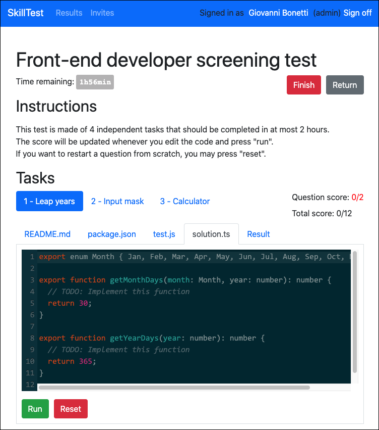
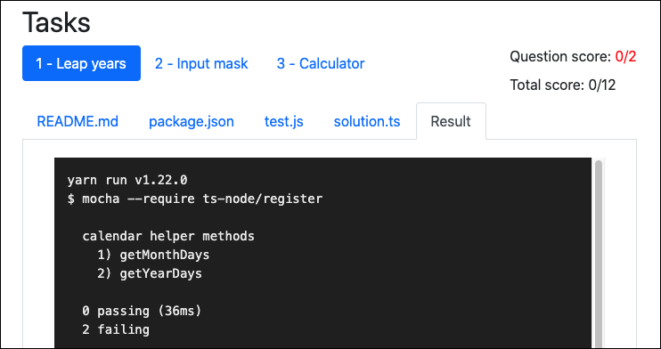

## Skilltest

This project is still on the works but will become public soon!
Check out the screenshots! 💻😎☕️

This project is built on top of Docker to run developer skill tests in containers. A task can be done in a programming language, SQL, a templating language, or anything else that runs on Linux. As long as it can be packaged in a Docker container you are good to make your own tasks following the examples.

This project requires access to the Docker API and hence CANNOT be used in a managed container environment:
- It does not work in [Heroku (even with Docker)](https://devcenter.heroku.com/articles/container-registry-and-runtime);
- It also does not work in [Google App Enginer Flexible environment](https://cloud.google.com/appengine/docs/flexible/)
- It also does not work with [Google Compute Engine if used with managed Docker containers](https://cloud.google.com/compute/docs/containers/deploying-containers)
- On the other hand, this project is a perfect fit for Kubernetes (K8S)! 🚢⚓️

The reason is simple: this project spins up new containers in _runtime_ to run developer code. All above environments impose a _static_ container. We recommend not using [Docker-in-Docker](https://github.com/jpetazzo/dind) either, as the authors strongly suggest to [stay away from it](http://jpetazzo.github.io/2015/09/03/do-not-use-docker-in-docker-for-ci/).
